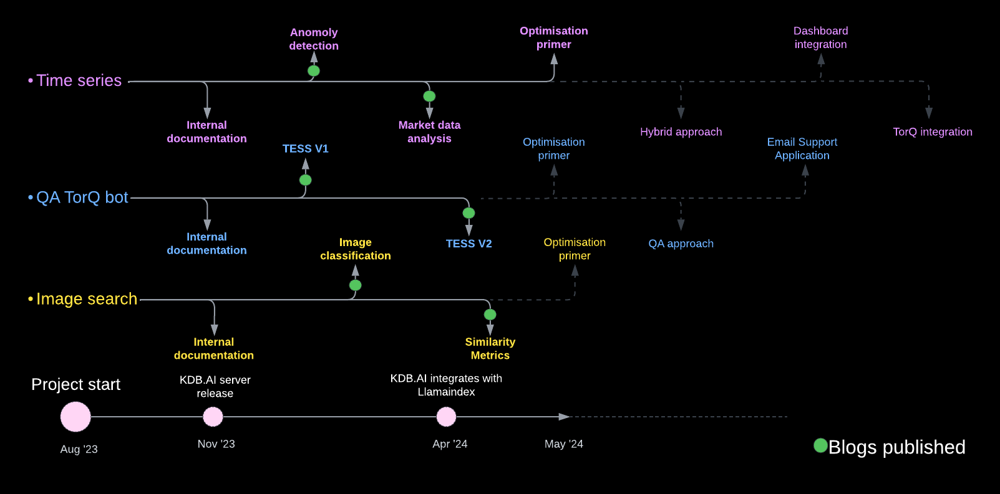

# Research into KX's vector database KDB.AI.

This is a repository to store Data Intellect's work using KDB.AI. The setup and prerequisites for this work along with the initial use-cases that our research is built on can be found in the [kdbai-samples repo](https://github.com/KxSystems/kdbai-samples/tree/main). Additional video breakdowns of all KX use-cases can be found [here](https://www.youtube.com/playlist?list=PLypX5sYuDqvpAhpIANTTUf5HrZkuWD1vm).

## Repository Breakdown

Our research into KDB.AI can be divided into three main sections:
* Image Search
* Time Series
* TorQ Bot

Each folder contains a README.md file explaining the objectives and progress on each area. 

## Project Roadmap

The following project roadmap highlights our progress to date. This can updated as the project progresses.

